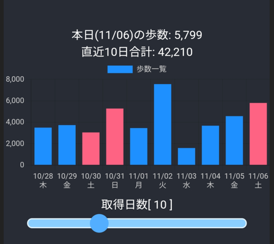

# Cordova & React & cordova-plugin-health

cordova + [cordova-plugin-health](https://github.com/dariosalvi78/cordova-plugin-health)プラグインを利用して、歩数を取得するサンプル




## 必要なこと

### Google Cloud Platform コンソールでプロジェクトを作成する。

https://console.cloud.google.com/cloud-resource-manager


### googlefit apiを有効にする

https://console.cloud.google.com/apis


Fitness APIをクリックして有効化


`APIとサービスの有効化` から'Fitness API'を検索して有効化する


### OAuth 同意画面を設定する

https://console.cloud.google.com/apis/credentials/consent


必須の下記3項目を入力して次へ
アプリ名、ユーザーサポートメール、デベロッパーの連絡先情報(メールアドレス)


歩数の取得に必要なスコープ不明のため、何も設定せずに次へ


テストユーザに自分を追加

### 認証情報を作成

https://console.cloud.google.com/apis/credentials


`OAuth 2.0 クライアント ID`にAndoroid用のクライアントIDと、ウェブアプリケーション用のIDの2つを追加する。
画面上部`認証情報の作成`から2つ作成する。

*  cordovaのアプリはネイティブアプリのため`Andoroid用のクライアントID` のみの設定で問題ないと思ったが、API利用の認証を得るために、ウェブアプリケーション用のIDも必要なようです。


|  アプリケーション種類  |  android  |
| ---- | ---- |
|  パッケージ名  |  config.xml の widget の idから |
|  SHA-1のフィンガープリント  |  下記(SHA1のフィンガープリントを指定する)  |


JDKのbinフォルダにPATHが通っていない場合は、カレントをbinに移動してから下記を実行する
```
keytool -list -v -keystore "%USERPROFILE%\.android\debug.keystore" -alias androiddebugkey -storepass android -keypass android

別名: androiddebugkey
作成日: 2021/10/16
エントリ・タイプ: PrivateKeyEntry
証明書チェーンの長さ: 1
証明書[1]:
所有者: C=US, O=Android, CN=Android Debug
発行者: C=US, O=Android, CN=Android Debug
シリアル番号: 1
有効期間の開始日: Sat Oct 16 14:53:13 JST 2021 終了日: Mon Oct 09 14:53:13 JST 2051
証明書のフィンガプリント:
         MD5:  XX:XX:XX:XX:XX:XX:XX:XX:XX:XX:XX:XX:XX:XX:XX:XX
         SHA1: XX:XX:XX:XX:XX:XX:XX:XX:XX:XX:XX:XX:XX:XX:XX:XX:XX:XX:XX:XX
         SHA256: XX:XX:XX:XX:XX:XX:XX:XX:XX:XX:XX:XX:XX:XX:XX:XX:XX:XX:XX:XX:XX:XX:XX:XX:XX:XX:XX:XX:XX:XX:XX:XX
署名アルゴリズム名: SHA1withRSA
サブジェクト公開鍵アルゴリズム: 2048ビットRSA鍵
バージョン: 1
```


|  アプリケーション種類  |  ウェブアプリケーション  |
| ---- | ---- |
|  承認済みの JavaScript 生成元  |  設定不要 |
|  承認済みのリダイレクト URI  |  設定不要  |


## How to build & run

cordovaコマンドは、`config.xml`と`wwww`が存在しない場合、`Current working directory is not a Cordova-based project.`というエラーになるため、先に`www`フォルダを作ります。

1. `npm install`
1. `mkdir www`
1. `cordova prepare`
1. `npm run build`
1. `cordova run android --target=XXXXXX`


---

## 以下、メモ書き
```
cordova plugin add cordova-plugin-health --variable HEALTH_READ_PERMISSION='App needs read access' --variable HEALTH_WRITE_PERMISSION='App needs write access'
```

`config.xml`に`<preference name="AndroidXEnabled" value="true" />`を追加


```
npm run build-inlinemap
cordova run --list
cordova run android --target=b764afd4
```
https://developers.google.com/fit/android/get-api-key
https://console.cloud.google.com/flows/enableapi?apiid=fitness


keytool -genkey -v -keystore debug.keystore -alias androiddebugkey -keyalg RSA -validity 10000 -dname "CN=Android Debug,O=Android,C=US"
